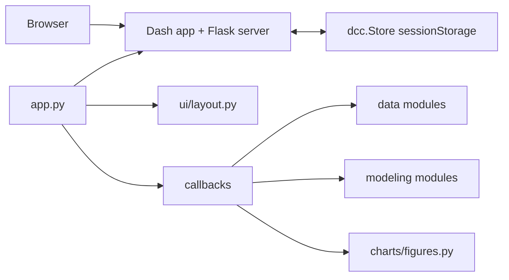
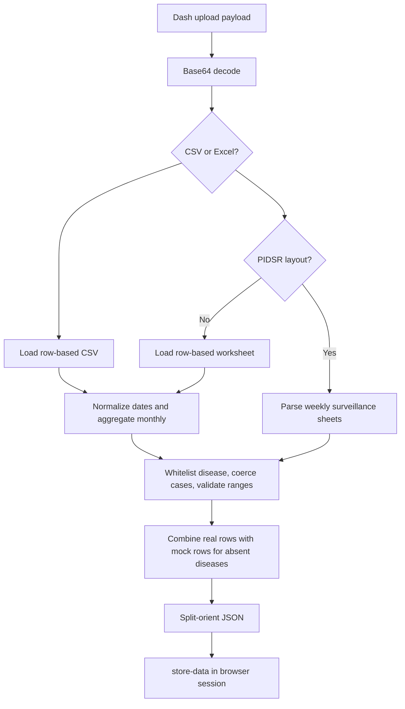
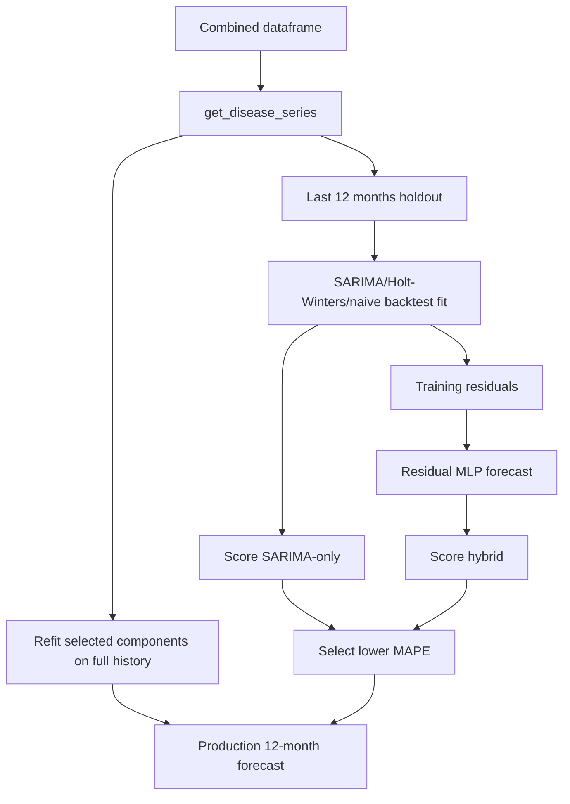

<!-- @format -->

# Antipolo Disease Surveillance Dashboard Architecture

## 1. Scope and purpose

Antipolo Dashboard is a Python Dash application for city-wide disease surveillance and 12-month forecasting. It combines uploaded DOH/PIDSR-style observations with deterministic synthetic fallback data for tracked diseases that are absent from an upload. Each disease can be forecast with a tiered SARIMA plus residual MLP pipeline, with a backtest safeguard that selects either the hybrid forecast or SARIMA-only forecast.

The application is a single-process web UI with browser-owned session state. It has no database, authentication, external API, or server-side model cache.

## 2. Runtime architecture

### Startup and deployment

- `dashboard/app_instance.py` constructs the shared `Dash` object and exposes `server = app.server`.
- `app.py` assigns `app.layout = build_layout()` and then imports `dashboard.callbacks` for decorator registration.
- Layout assignment intentionally occurs before callback import because callback validation may inspect the component tree.
- `python app.py` starts the Dash development server using `HOST`, `PORT`, and `DASH_DEBUG`.
- Gunicorn imports `app:server`; `app.py` still performs layout and callback wiring, but does not call `app.run()`.
- `Dockerfile` and `Procfile` currently use one Gunicorn worker and a 600-second timeout. The README currently documents two workers and a 120-second timeout, so the operational source of truth is inconsistent.

### Dependency baseline

- `pyproject.toml` defines version ranges and development extras.
- `requirements.txt` pins runtime versions.
- There is no lockfile tying these resolutions together. Reproducibility depends on which manifest and environment is used.

## 3. Domain and configuration model

`dashboard/config.py` is the dependency-free configuration root. It defines:

- Seven tracked diseases: Dengue, Acute Respiratory Infection, Influenza-like Illness, Tuberculosis, Hand Foot & Mouth Disease, Measles, and Leptospirosis.
- Three recognized real workbook sheets: Dengue, Measles-Rubella mapped to Measles, and Leptospirosis.
- Synthetic history from January 2016 through December 2025, giving 120 months.
- A 12-month holdout and 12-month production forecast horizon.
- Small NNAR settings: three residual lags, one hidden layer of four units, and strong regularization.
- A fixed display baseline of 32.22% MAPE.

The configuration module is intentionally one-directional: other modules import from it, but it imports from none of them. This prevents package-level circular dependencies.

## 4. Data architecture

### Input contracts

The upload callback accepts `.csv` and `.xlsx` by filename. Legacy `.xls` is
deliberately rejected because the deployment does not include an `.xls` parsing
engine.

Row-based CSV and XLSX input must contain `disease`, `cases`, and one supported
date representation: `year`/`month`, `year`/`week`, or a recognized date column
(`date`, `report_date`, `reporting_date`, `onset_date`, `observation_date`,
`period`, or `reporting_period`). Headers are stripped, lowercased, and
normalized before matching. The user selects day-first, month-first, or
year-first handling for ambiguous numeric dates. ISO dates/timestamps, textual
dates/months, and Excel date serials are also supported. Daily and weekly rows
are aggregated to monthly totals.

DOH/PIDSR workbook input is expected to have one recognized sheet per disease. The parser:

1. Opens the workbook from bytes.
2. Matches sheet names case-insensitively and ignoring surrounding whitespace.
3. Searches the first ten rows for `Morbidity Week`.
4. Accepts week rows 1 through 53 and ignores total/verification rows.
5. Converts epidemiological weeks to the month containing that week's Thursday.
6. Assigns non-ISO week 53 reports to December of the reporting year.
7. Aggregates weekly cells by year, month, and canonical disease name.

If the specialized workbook layout is absent, the loader searches ordinary
row-based worksheets for the same disease, cases, and date contract.

Text-based PDFs are converted outside the web application with
`python -m dashboard.data.pdf_converter`. The converter creates canonical CSV
or XLSX plus a JSON extraction/validation report. It does not perform OCR, and
its output requires review against the source PDF before upload.

### Validation and combination flow

`dashboard/callbacks/data_callbacks.py::load_data` owns orchestration:

- On first load, it generates mock data.
- On refresh, it preserves an existing `store-data` value.
- On upload, it decodes and dispatches by extension.
- It validates the parsed frame and marks accepted rows as `source = "real"`.
- It applies the user-selected convention to ambiguous dates and records all
  parsing, aggregation, and rejected-row notes in the upload summary.
- It calls `combine_real_and_mock` to backfill complete missing diseases with mock data.
- It stores the combined frame as pandas split JSON.

`dashboard/data/validation.py` applies these rules:

- Disease names are matched case- and whitespace-insensitively and rewritten to canonical names.
- Unknown diseases are dropped with notes.
- Non-numeric cases are dropped.
- Negative cases are clipped to zero.
- Months outside 1-12 and years outside 1900-2100 are dropped.
- Remaining numeric values are rounded to integer cases.

`dashboard/data/combine.py` only backfills diseases that have no real rows at all. It does not backfill missing months within a disease's real history. Later, `get_monthly_series` fills internal gaps with zero. Therefore a partially reported disease can be modeled as if every absent month had zero cases; this is a semantic decision and a correctness risk if absence means unknown rather than zero.

The `source` column preserves row-level provenance. Pipeline source detection reports a disease as real if any row for it is marked real, even when the same disease's history is incomplete.

## 5. Modeling architecture

### Per-disease flow

### Series preparation

`dashboard/modeling/series_utils.py` filters to one disease, aggregates duplicate dates, sorts by date, and creates a monthly frequency with zero-filled missing months. The pipeline rejects histories shorter than `holdout + 36` months, currently 48 months by default.

### SARIMA tier

`dashboard/modeling/sarima.py::run_arima` uses this fallback sequence:

1. For at least 36 months, fit SARIMA `(1,1,1)(0,1,1)[12]`.
2. If history is shorter or SARIMA fails/convergence warnings are raised, fit additive Holt-Winters with a 12-month seasonality.
3. If Holt-Winters fails, use a non-negative naive drift forecast.

The function returns fitted values, forecast means, confidence bounds, the selected tier, and human-readable notes. Confidence intervals are derived from SARIMA when that tier succeeds, or from residual spread/forecast horizon in fallback tiers.

`run_decomposition` separately provides additive seasonal decomposition when at least 24 observations exist.

### NNAR/residual correction

`dashboard/modeling/nnar.py::run_nnar` is an `sklearn.neural_network.MLPRegressor` trained on lagged SARIMA residuals. It standardizes lag inputs, fits a small regularized network, and recursively predicts future residuals. It returns zero residual forecasts when insufficient residual history exists.

This is an MLP residual correction model described in the UI as NNAR; it is not a canonical statistical NNAR implementation. That distinction should remain explicit in technical and user-facing documentation.

### Selection and production

`dashboard/modeling/pipeline.py::run_hybrid_pipeline`:

1. Builds the monthly series and validates minimum history.
2. Fits the backtest leg on all but the last 12 months.
3. Scores SARIMA-only and hybrid forecasts with RMSE, MAE, and MAPE.
4. Selects hybrid only when its unrounded MAPE is strictly lower.
5. Refits the production leg on the full series.
6. Returns both component forecasts plus the selected final forecast.
7. Uses the selected model's backtest metrics as `final_metrics`.

Forecast values are clipped to non-negative values after recombination. The safeguard guarantees only that the selected model won this particular held-out backtest. It does not guarantee future superiority. The UI also compares the selected MAPE with a fixed 32.22% display threshold, not a dynamically calculated baseline for the current upload.

### Serialization

`dashboard/modeling/serialization.py` converts each pandas Series to `{index, values}` and retains scalar metrics/model metadata. Serialized results are stored in `store-hybrid` under disease names, alongside a dataset SHA-256 signature.

## 6. UI and feature architecture

`dashboard/ui/layout.py::build_layout` builds the complete page tree without registering callbacks. The main user-visible features are:

- Initial synthetic dataset and upload status.
- Flexible-date CSV, flat XLSX, or DOH/PIDSR workbook upload.
- A prominent overview source banner and selected-forecast source badge.
- Year-range filtering for aggregate displays.
- Aggregate disease filtering.
- Lazy per-disease hybrid forecasting.
- Forecast, backtest, residual, and decomposition charts.
- Cross-disease donut, seasonal heatmap, annual burden chart, and annual data table.
- Data-source labels and model warning details.
- Forecast CSV download and chart PNG export.

`dashboard/ui/components.py` contains reusable metric and section builders. `dashboard/styles.py` holds visual constants and inline style dictionaries. `dashboard/charts/figures.py` is the only chart construction layer; callbacks pass data and model results into figure builders.

### Callback contracts

`dashboard/callbacks/data_callbacks.py` registers `load_data`, which writes
`store-data`, `upload-status`, and `store-upload-summary`.

`dashboard/callbacks/view_callbacks.py` registers:

- `update_hybrid_dropdown_status`: derives per-disease status icons from `store-hybrid`.
- `render_data_source_indicators`: renders aggregate and selected-disease
  provenance labels from the active dataset.
- `render_hybrid_section`: consumes dataset JSON, selected forecast disease, year range, and hybrid cache; returns cache, metric cards, warnings, and four figures.
- `update_forecast_download_state` and `download_forecast_csv`: enable and
  produce a provenance-bearing export only after the selected forecast is ready.
- `render_upload_summary`: renders source coverage, validation notes, and a
  preview from persisted upload metadata.
- `update_aggregate_section`: consumes dataset JSON, year range, and aggregate disease filter; returns aggregate metrics, three figures, and a table.

### Lazy computation and cache invalidation

The first selected disease is modeled on demand. Subsequent selections reuse the serialized result. Changing the dataset signature clears the disease results before recomputing. Year-range changes crop the displayed history but do not retrain models.

Failures are stored per disease and rendered as an error panel. Model warnings are retained and displayed in an expandable panel. Malformed stored data and stale cached result schemas are handled as user-visible errors rather than page-wide crashes.

## 7. Existing verification

Current tests cover:

- Epidemiological week conversion, including invalid week 53 behavior.
- Workbook parsing, fuzzy sheet matching, missing sheets, and invalid files.
- Disease filtering, negative values, numeric coercion, and range validation.
- Metrics, zero actual values, clipping, SARIMA tiers, decomposition, NNAR degradation, pipeline history requirements, model selection, source detection, and serialization round trips.
- Import/startup, complete Dash layout construction, callback IDs, and callback wiring.
- CSV and XLSX uploads, malformed base64, encoding failures, flexible dates,
  monthly aggregation, and partial real/mock combination.
- Lazy computation, cache hits, dataset-signature invalidation, malformed stores,
  dropdown states, provenance rendering, and forecast export contracts.
- Offline PDF conversion output and audit-report behavior with mocked extracted tables.

Important remaining coverage gaps:

- Browser session-size behavior for large uploads and all seven model results.
- Public-upload resource limits and malicious/oversized workbooks.
- Gunicorn/container startup smoke tests.
- End-to-end table extraction against redistribution-approved source PDF fixtures.

## 8. Prioritized remediation roadmap

### P0: Correctness and operational safety

1. **Define missing-month semantics.** Decide whether absent observations represent zero cases or unknown reporting. If unknown, preserve an observation mask and prevent implicit zero-fill from entering training without an explicit policy.
2. **Add a startup smoke test.** Import `app:server` under the deployment
   command and verify `/healthz` in a built container.

### P1: Forecast transparency and reproducibility

3. **Make uncertainty labeling model-aware.** When hybrid is selected, label the interval as SARIMA-derived uncertainty or implement an interval method that accounts for residual correction. Do not imply the displayed interval fully represents hybrid uncertainty.
4. **Replace or qualify the fixed baseline.** Calculate baseline comparisons from the current backtest, or label 32.22% as a historical reference rather than a current model-quality threshold.
5. **Unify dependency resolution.** Generate and maintain a lockfile or make one manifest authoritative for deployment and development. Verify the pinned set against the declared Python version.
6. **Clarify NNAR naming.** Use a name such as `SARIMA + residual MLP` in technical metadata, while retaining NNAR only if required by the project terminology.

### P2: Usability and scalability

7. **Move large state out of browser session storage.** For larger deployments, store normalized uploads and model results server-side with per-session identifiers, expiry, and access controls. Browser storage can remain a small-client fallback.
8. **Add approved source-PDF fixtures.** Exercise real text-table extraction end to
   end once representative documents can be redistributed with the test suite.

## 10. Deployment-readiness remediation completed

The following controls are now implemented and covered by regression tests:

- `.csv` and `.xlsx` uploads are limited to 10 MB; CSV parsing is limited to
  100,000 rows.
- Excel parsing is limited to 20 sheets, 10,000 rows per parsed worksheet, 250
  columns per worksheet, and 1,000,000 parsed cells across the workbook.
- CSV headers are stripped and lowercased before required-column validation.
- Row-based CSV/XLSX dates are normalized under an explicit user-selected
  convention and daily/weekly rows are aggregated to monthly totals.
- Forecast callbacks have direct regression tests for lazy computation, cache
  reuse/invalidation, safe failures, source indicators, and export readiness.
- Text-based PDF extraction is isolated in an offline converter with a mandatory
  JSON review report; it never runs in a web upload callback.
- Legacy `.xls` is rejected because the deployment does not include an `.xls`
  parsing engine.
- Malformed upload, stored-data, cache, and rendering failures log details on
  the server but return bounded messages to the browser.
- `/healthz` provides a lightweight platform/container probe; the Docker image
  declares a matching `HEALTHCHECK`.
- `.dockerignore` excludes repository metadata, tests, caches, virtual
  environments, and local logs from the image context.
- Dockerfile, Procfile, README deployment examples, and `pyproject.toml` now
  agree with the pinned runtime dependencies and one-worker/600-second
  Gunicorn policy.
- Dependabot is configured to open monthly updates for pip dependencies and
  GitHub Actions metadata; `pip-audit -r requirements.txt` remains the release
  verification check for known advisories.

## 9. Recommended implementation order

1. Add callback/startup integration tests and establish the current contract.
2. Reconcile deployment manifests and add resource limits.
3. Decide and implement missing-observation semantics.
4. Correct uncertainty and baseline labeling.
5. Improve provenance and CSV/Excel usability.
6. Revisit server-side state only when deployment scale requires it.

The existing modular boundaries are suitable for these changes. Data semantics belong in `dashboard/data` and `series_utils.py`; model-selection and uncertainty behavior belong in `dashboard/modeling`; state/resource controls belong in callbacks and deployment configuration; presentation changes belong in layout and chart builders.
