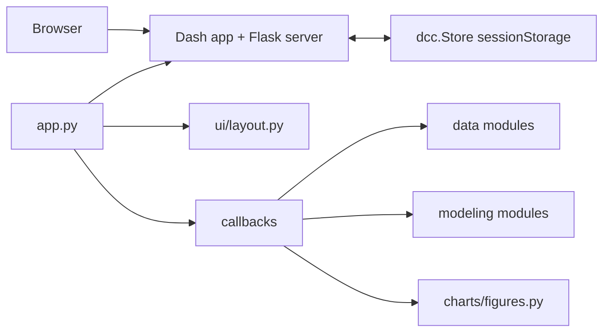
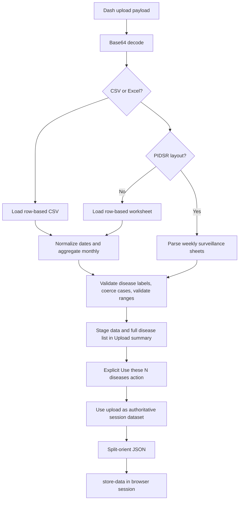

<!-- @format -->

# Antipolo Disease Surveillance Dashboard Architecture

## 1. Scope and purpose

Antipolo Dashboard is a Python Dash application for disease surveillance and 12-month forecasting. It opens with a deterministic seven-disease synthetic sample; an explicitly confirmed upload replaces that sample with the upload's own disease catalog for the current browser session. Each disease uses a mandatory SARIMA plus residual MLP (NNAR) primary forecast, with independently reported SARIMA-only and seasonal-naive benchmarks.

The application is a single-process web UI with browser-owned session state. It has no database, authentication, external API, or server-side model cache.

## 2. Runtime architecture

### Startup and deployment

- `dashboard/app_instance.py` constructs the shared `Dash` object and exposes `server = app.server`.
- `app.py` assigns `app.layout = build_layout()` and then imports `dashboard.callbacks` for decorator registration.
- Layout assignment intentionally occurs before callback import because callback validation may inspect the component tree.
- `python app.py` starts the Dash development server using `HOST`, `PORT`, and `DASH_DEBUG`.
- Gunicorn imports `app:server`; `app.py` still performs layout and callback wiring, but does not call `app.run()`.
- `Dockerfile` and `Procfile` currently use one Gunicorn worker and a 600-second timeout. The README now agrees with this policy; deployment of the revised model was not tested.

### Dependency baseline

- `pyproject.toml` defines version ranges and development extras.
- `requirements.txt` pins runtime versions.
- There is no lockfile tying these resolutions together. Reproducibility depends on which manifest and environment is used.

## 3. Domain and configuration model

`dashboard/config.py` is the dependency-free configuration root. It defines:

- Seven synthetic sample diseases: Dengue, Acute Respiratory Infection, Influenza-like Illness, Tuberculosis, Hand Foot & Mouth Disease, Measles-Rubella, and Leptospirosis. This is not an upload whitelist.
- Optional historical worksheet aliases, preserving Measles-Rubella as Measles-Rubella; any worksheet with a valid weekly table is accepted under its own sheet name.
- Synthetic history from January 2016 through December 2025, giving 120 months.
- A 12-month holdout and 12-month production forecast horizon.
- Small NNAR settings: three residual lags, one hidden layer of four units, and strong regularization.
- A seasonal-naive benchmark calculated from the same rolling/holdout windows as the candidate models.

The configuration module is intentionally one-directional: other modules import from it, but it imports from none of them. This prevents package-level circular dependencies.

## 4. Data architecture

### Input contracts

The upload callback accepts `.csv` and `.xlsx` by filename. Legacy `.xls` is
deliberately rejected because the deployment does not include an `.xls` parsing
engine.

Row-based CSV and XLSX input must contain `disease`, `cases`, and one supported
date representation: `year`/`month`, `year`/`week`, or a recognized date column
(`date`, `report_date`, `reporting_date`, `onset_date`, `observation_date`,
`period`, or `reporting_period`). Headers are stripped, lowercased, and
normalized before matching. The user selects day-first, month-first, or
year-first handling for ambiguous numeric dates. ISO dates/timestamps, textual
dates/months, and Excel date serials are also supported. Daily and weekly rows
are aggregated to monthly totals.

DOH/PIDSR workbook input may have one weekly matrix sheet per disease. The parser:

1. Opens the workbook from bytes.
2. Uses each qualifying worksheet name as its disease label, applying configured aliases case-insensitively where available.
3. Searches the first ten rows for `Morbidity Week`.
4. Accepts week rows 1 through 53 and ignores total/verification rows.
5. Converts epidemiological weeks to the month containing that week's Thursday.
6. Assigns non-ISO week 53 reports to December of the reporting year.
7. Aggregates weekly cells by year, month, and disease name.

If the specialized workbook layout is absent, the loader searches ordinary
row-based worksheets for the same disease, cases, and date contract.

Text-based PDFs are converted outside the web application with
`python -m dashboard.data.pdf_converter`. The converter creates canonical CSV
or XLSX plus a JSON extraction/validation report. It does not perform OCR, and
its output requires review against the source PDF before upload. The report's
`dashboard_ready` flag remains false when source scope, printed-total checks,
or the absence of valid monthly disease rows makes dashboard use unsafe.

### Validation and combination flow

`dashboard/callbacks/data_callbacks.py::load_data` owns orchestration:

- On first load, it generates mock data.
- On refresh, it preserves an existing `store-data` value.
- On upload, it decodes and dispatches by extension.
- It validates the parsed frame and marks accepted rows as `source = "real"`.
- It applies the user-selected convention to ambiguous dates and records all
  parsing, aggregation, and rejected-row notes in the upload summary.
- It keeps only the validated uploaded disease series; sample diseases are not backfilled.
- It stages the uploaded frame as pandas split JSON in memory-only `store-pending-upload`.
- Only the confirmation-button event activates that exact candidate. Prior click counts do not authorize subsequent uploads.
- The active dataset and summary remain unchanged during review or rejection; reset clears pending data and refresh discards it.
- A visible reset action replaces session data with the built-in synthetic sample.

`dashboard/data/validation.py` applies these rules:

- Arbitrary disease names are accepted after whitespace normalization.
- Case-only duplicates within an upload are unified to the first supplied spelling.
- Blank or longer-than-200-character names, invalid/fractional/negative/nonfinite counts,
  invalid/nonintegral dates and duplicate monthly observations are rejected.
- Daily/weekly aggregation preserves source/population/classification metadata.
- Mixed populations, case classifications and synthetic/real sources are rejected.

`dashboard/data/combine.py::prepare_uploaded_data` only adds the canonical monthly date to validated uploaded rows. It never mixes the seven-disease sample into a real upload. A compatibility alias preserves the old helper import name. The forecast pipeline rejects internal monthly gaps before `get_monthly_series` establishes monthly frequency, so an absent report cannot silently become a modeled zero. Explicit zero-case rows remain valid observations.

The `source` column preserves row-level provenance. The pipeline requires a single source category per disease and preserves population, case classification, dataset and coverage metadata. Eligibility is never inferred from an upload label.

## 5. Modeling architecture

The implemented primary path is `max(0, raw SARIMA prediction + recursive NNAR residual prediction)`.
Benchmarks never replace it. No Holt-Winters, drift, or skipped-NNAR zero correction is substituted.

### Identification within each training window

`modeling/sarima.py::run_arima` tries 12 candidates per window: D in {0,1}; for each D,
ADF with constant/autolag AIC on seasonally transformed training values sets d=1 when p>0.05,
otherwise d=0. Constant series use d=0 with ADF marked undefined. For each branch,
(p,q) is (1,0), (0,1), or (1,1), and (P,Q) is (1,0) or (0,1); period=12.
ACF/PACF through lag 12 (or feasible shorter length) are recorded for inspection; they do
not automatically interpret every significant lag as an order or prove the bounded search exhaustive.

All candidates use trend='c', enforce_stationarity=True, enforce_invertibility=True,
maxiter=300 and common loglikelihood_burn=13. This common scored span avoids favoring
models merely by omitting different initialization observations. Candidate failures,
optimizer convergence, warnings, AIC, minimum root modulus and Ljung-Box lag-12 p-values
(model_df=p+q+P+Q) are retained. Nonconverged/nonfinite fits or roots<=1.000001 are rejected.
Lowest AIC selects among valid fits; residual autocorrelation is a visible warning, not
proof of predictive accuracy or automatic exclusion. These are reproducible engineering
choices for the requested search, not researcher approval of exact bounds or thresholds.

The NNAR component is attempted on the selected base; if it fails, remaining valid
SARIMA candidates are tried in AIC order. The independent SARIMA benchmark remains the
lowest-AIC valid SARIMA regardless of NNAR feasibility. Complete failure raises
`ModelFailure` with status `sarima_failure` or `nnar_failure` and search diagnostics.
Available benchmark diagnostics are retained in the failure object.

### Residual and neural definition

Residuals are observed counts minus one-step in-sample fitted SARIMA means, excluding the
first 13 initialization observations. They never use future holdout actuals. Neural settings
retain the baseline: 3 lags, one hidden layer of 4 ReLU units, lbfgs, alpha=10,
max_iter=2000, random_state=42. StandardScaler is fitted only on training lag features;
target residuals are unscaled. Future residuals are recursive. Iterations and convergence
warnings are stored with each window. Finite forecasts with convergence warnings are
`hybrid_with_warnings`; insufficient residuals or fit exceptions are explicit failures.
This is an MLP residual autoregression, not a package-specific NNAR ensemble.

### Evaluation, refit and uncertainty

For 120 months beginning January 2016: train through 2022/test2023, train through
2023/test2024, train through2024/test2025, then refit through2025/forecast2026.
Every SARIMA search is repeated inside its own training window. Earlier-fold comparisons
are diagnostics; `selected_model` is always `hybrid`, `selection_threshold` is null.
The compatibility `selection_*` fields retain their names but no longer select the primary.
2025 remains outside algorithmic search, although its prior human exposure prevents
claiming a pristine, newly unseen confirmatory holdout.

All comparable forecasts use identical actual dates. MAE=mean(abs(error));
RMSE=sqrt(mean(error^2)); MAPE=100*mean(abs(error/actual)) over nonzero actuals;
WAPE=100*sum(abs(error))/sum(abs(actual)). Undefined MAPE/WAPE return null.
Both SARIMA and seasonal-naive benchmarks are retained even if their errors are lower.
Seasonal naive repeats the last 12 training months. Raw component forecasts are exported;
nonnegative clipping happens after hybrid addition, and separately for count benchmarks.

Production uses the full available history after evaluation. The displayed error band
is forecast +/- max(abs(error)) from the earlier folds plus final holdout, lower clipped
to zero. It has no validated coverage guarantee. SARIMA component confidence bounds
are not passed off as a hybrid prediction interval. Decomposition is descriptive only.

### State and provenance

Monthly gaps, duplicate dates, invalid counts, known incomplete week1-52 coverage and
mixed provenance values are rejected before series aggregation. Default minimum is72
months. Week53 calendar/blank meaning remains provisional. Result metadata includes
status, population, case classification, dataset, coverage, every SARIMA search and NNAR
settings, fold dates, actuals, forecasts and metrics. No upload assertion establishes
verified ages5-19 confirmed-case eligibility; eligible data remain unavailable.

Serialization converts Series to `{index,values,name}` and retains JSON diagnostics;
cache schema `mandatory-hybrid-provenance-v6` invalidates historical conditional-model
results and the SHA256 dataset signature includes stored metadata.

## 6. UI and feature architecture

`dashboard/ui/layout.py::build_layout` builds the complete page tree without registering callbacks. The main user-visible features are:

- Initial synthetic dataset and upload status.
- Flexible-date CSV, flat XLSX, or DOH/PIDSR workbook upload.
- A prominent overview source banner and selected-forecast source badge.
- Year-range filtering for aggregate displays.
- Aggregate disease filtering.
- Lazy per-disease hybrid forecasting.
- Forecast, backtest, residual, and decomposition charts.
- Cross-disease donut, seasonal heatmap, annual burden chart, and annual data table.
- Data-source labels and model warning details.
- Forecast CSV download and chart PNG export.

`dashboard/ui/components.py` contains reusable metric and section builders. `dashboard/styles.py` holds visual constants and inline style dictionaries. `dashboard/charts/figures.py` is the only chart construction layer; callbacks pass data and model results into figure builders.

### Callback contracts

`dashboard/callbacks/data_callbacks.py` registers `handle_data_session`, the single writer
for `store-data`, `upload-status`, `store-upload-summary`, and `store-pending-upload`.
`load_data` parses and stages candidates; `confirm_pending_upload` requires explicit confirmation.
`transition_data_session` dispatches by the triggering control, preventing old clicks from approving new uploads.

`dashboard/callbacks/view_callbacks.py` registers:

- `update_hybrid_dropdown_status`: derives per-disease status icons from `store-hybrid`.
- `render_data_source_indicators`: renders aggregate and selected-disease
  provenance labels from the active dataset.
- `render_hybrid_section`: consumes dataset JSON, selected forecast disease, year range, and hybrid cache; returns cache, metric cards, warnings, and four figures.
- `update_forecast_download_state` and `download_forecast_csv`: enable and
  produce a provenance-bearing export only after the selected forecast is ready.
- `render_upload_summary`: renders source coverage, validation notes, and a
  preview from pending metadata during review, otherwise from persisted active metadata.
- `render_upload_confirmation`: labels and enables the confirmation action only for a valid pending candidate.
- `render_technical_baselines`: shows the fixed historical reference and live benchmark in Technical model details.
- `update_aggregate_section`: consumes dataset JSON, year range, and aggregate disease filter; returns aggregate metrics, three figures, and a table.

### Lazy computation and cache invalidation

The first selected disease is modeled on demand. Subsequent selections reuse the serialized result. Changing the dataset signature clears the disease results before recomputing. Year-range changes crop the displayed history but do not retrain models.

Failures are stored per disease and rendered as an error panel. Model warnings are retained and displayed in an expandable panel. Malformed stored data and stale cached result schemas are handled as user-visible errors rather than page-wide crashes.

## 7. Existing verification

Current tests cover:

- Epidemiological week conversion, including invalid week 53 behavior.
- Workbook parsing, fuzzy sheet matching, missing sheets, and invalid files.
- Disease filtering, negative values, numeric coercion, and range validation.
- Exact RMSE/MAE/MAPE/WAPE behavior, zero-actual denominator coverage, missing-month rejection, 72-month eligibility, mandatory hybrid despite worse benchmark error, training-window isolation, non-negative historical error bands, forecast-line bindings, bounded SARIMA identification, decomposition, explicit NNAR failure, source detection, and serialization round trips.
- Import/startup, complete Dash layout construction, callback IDs, and callback wiring.
- CSV and XLSX uploads, malformed base64, encoding failures, flexible dates,
  monthly aggregation, authoritative upload replacement, and session reset.
- Lazy computation, cache hits, dataset-signature invalidation, malformed stores,
  dropdown states, provenance rendering, and forecast export contracts.
- Offline PDF conversion output and audit-report behavior with mocked extracted tables.

Current verification is recorded in `TEST_RESULTS.md`; historical test counts do not certify the revised methodology.

Important remaining coverage gaps:

- Browser session-size behavior for large uploads and many dynamically named disease-model results.
- Resource-limit regression tests exist; comprehensive adversarial workbook behavior is not established.
- Gunicorn/container startup smoke tests.
- End-to-end table extraction against redistribution-approved source PDF fixtures.

## 8. Prioritized remediation roadmap

### P0: Correctness and operational safety

1. **Add a startup smoke test.** Import `app:server` under the deployment
   command and verify `/healthz` in a built container.

### P1: Forecast transparency and reproducibility

2. **Calibrate across more real outcomes.** The current historical maximum-error band is model-aware but has no claimed prospective coverage. A future probabilistic interval needs independent, horizon-specific validation on representative real surveillance series.
3. **Unify dependency resolution.** Generate and maintain a lockfile or make one manifest authoritative for deployment and development. Verify the pinned set against the declared Python version.
4. **Clarify NNAR naming.** Use a name such as `SARIMA + residual MLP` in technical metadata, while retaining NNAR only if required by the project terminology.

### P2: Usability and scalability

7. **Move large state out of browser session storage.** For larger deployments, store normalized uploads and model results server-side with per-session identifiers, expiry, and access controls. Browser storage can remain a small-client fallback.
8. **Add approved source-PDF fixtures.** Exercise real text-table extraction end to
   end once representative documents can be redistributed with the test suite.

## 10. Deployment-readiness remediation completed

The following controls are now implemented and covered by regression tests:

- `.csv` and `.xlsx` uploads are limited to 10 MB; CSV parsing is limited to
  100,000 rows.
- Excel parsing is limited to 20 sheets, 10,000 rows per parsed worksheet, 250
  columns per worksheet, and 1,000,000 parsed cells across the workbook.
- CSV headers are stripped and lowercased before required-column validation.
- Row-based CSV/XLSX dates are normalized under an explicit user-selected
  convention and daily/weekly rows are aggregated to monthly totals.
- Forecast callbacks have direct regression tests for lazy computation, cache
  reuse/invalidation, safe failures, source indicators, and export readiness.
- Text-based PDF extraction is isolated in an offline converter with a mandatory
  JSON review report; it never runs in a web upload callback.
- Legacy `.xls` is rejected because the deployment does not include an `.xls`
  parsing engine.
- Malformed upload, stored-data, cache, and rendering failures log details on
  the server but return bounded messages to the browser.
- `/healthz` provides a lightweight platform/container probe; the Docker image
  declares a matching `HEALTHCHECK`.
- `.dockerignore` excludes repository metadata, tests, caches, virtual
  environments, and local logs from the image context.
- Dockerfile, Procfile, README deployment examples, and `pyproject.toml` now
  agree with the pinned runtime dependencies and one-worker/600-second
  Gunicorn policy.
- Dependabot is configured to open monthly updates for pip dependencies and
  GitHub Actions metadata; `pip-audit -r requirements.txt` remains the release
  verification check for known advisories.

## 9. Recommended implementation order

1. Add callback/startup integration tests and establish the current contract.
2. Reconcile deployment manifests and add resource limits.
3. Decide and implement missing-observation semantics.
4. Correct uncertainty and baseline labeling.
5. Improve provenance and CSV/Excel usability.
6. Revisit server-side state only when deployment scale requires it.

The existing modular boundaries are suitable for these changes. Data semantics belong in `dashboard/data` and `series_utils.py`; model-selection and uncertainty behavior belong in `dashboard/modeling`; state/resource controls belong in callbacks and deployment configuration; presentation changes belong in layout and chart builders.

### Historical reference and live benchmark

**Historical reference MAPE: 32.22%** is a fixed external/thesis reference,
not computed from the active dataset. Source: [Olana et al. (2025), Table 1](https://doi.org/10.1155/tbed/7480710), national dengue SARIMA testing MAPE; applicability as an Antipolo threshold is not established.
**Seasonal-naive holdout MAPE/WAPE** is computed separately for each disease
and active dataset by copying the previous year's monthly observations into
the same untouched 12-month holdout. MAPE excludes zero-actual months; WAPE
uses the sum of absolute actual cases as its denominator. Undefined scores
are shown as N/A. The UI displays MAPE first, then WAPE, separated by a slash.
These are distinct references, shown side by side with neutral styling; they
are not merged, averaged, ranked against each other, or used to select a model.
Seasonal naive remains a diagnostic benchmark, not a production candidate.

Current findings and the single decision ledger are linked from [CHATGPT_RETURN_HANDOFF.md](CHATGPT_RETURN_HANDOFF.md). THESIS_READINESS.md and AGENT_HANDOFF.md are preserved historical evidence.
